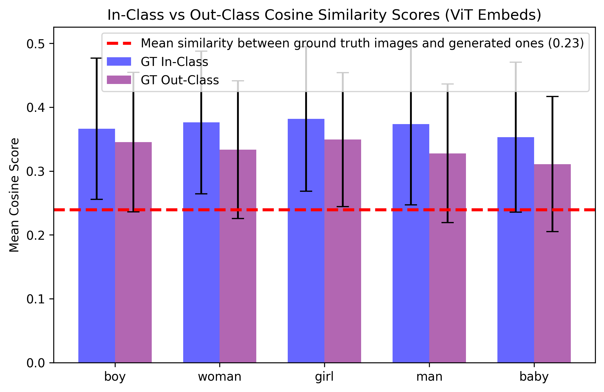
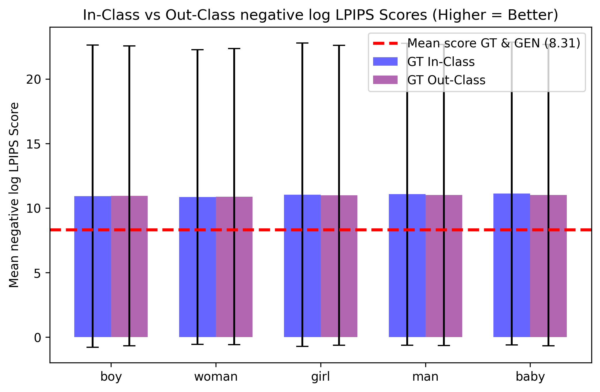

# LUMA-unbias

An attempt to aliviate the bias present in [LUMA](https://arxiv.org/abs/2406.09864)'s textual moduality.

## Text as a latent approach

The idea is for the generated captions to behave as some kind of latent space (as of that of autoencoders), this latent space must have as much information as possible so that we can reproduce the original image, by avoiding the use of non-factual signals. I state that because of this it could also help in avoiding the inclusion of biases.

1. Generate the captions using a VLM (eg. Paligamma).
2. Use the captions to generate an image, using some kind of diffusion model (eg. Stable diffusion).
3. Use a vision encoder (eg. a ViT) to generate embeddings of both the reference image and the generated image.
4. Compare the generated embeddings using some similarity metric.
5. Pick only the most similar items.

The major issue of this approach is that there are confounding factors, low similarity could indicate any of:

1. Poor VLM descriptions
2. Poor image generation
3. Poor choice of a similarity metric

## Testing with some similarity metrics

### Cosine similarity (ViT Embeds) (Higher Better)

The results show that the similarity scores between generated images and their ground truth is lower! than that of ground truth with images from other classes



### Lpips (AlexNet) (Lower better)

Surprisingly the Lpips metric seems to be worse at distinguishing between in and out class images, we should be a fundamental basis for better asessing the similarities of images.


### Negative Log Lpips (AlexNet) (Higher better)

I had to move to the log scale to visualize against the mean between generated and ground truth images, the results seem to follow that of cosine similarity with regards to out vs mean gen and grond truth.



### Current conclusion

From the Cosine and Lpips results we find that the similarity scores assigned to generated images with their ground truth are **on average consistently worse** than those of images and their out class (other labels) similarities, it would be acceptable for it to be worse than in class, but this doesn't make sense.

An explanation for the bad results might be that the dimension of ciphar (3, 32, 32) are too distant for the generated images, when streching to 3, 244, 244, we are emplifiying the differences.

Exploring other similarity metrics seems like a dead end, and perhaps even this appraoch of text as an embedding.

## Next steps

Another pipeline:

- Filter captions using clip score, but the question is clip robust to these low res images?
- Work on some chain of thought (CoT) style from cleaning the capitons

## Reference

```bibtex

@article{bezirganyan2024lumabenchmarkdatasetlearning,
      title={LUMA: A Benchmark Dataset for Learning from Uncertain and Multimodal Data}, 
      author={Grigor Bezirganyan and Sana Sellami and Laure Berti-Équille and Sébastien Fournier},
      year={2024},
      eprint={2406.09864},
      archivePrefix={arXiv},
      primaryClass={cs.LG},
      url={https://arxiv.org/abs/2406.09864}, 
}
```
